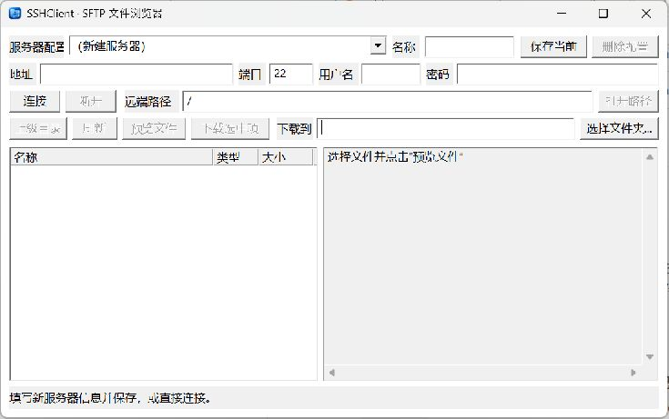

# SSHClient 初版

这是一个 Windows 桌面 SFTP 客户端，使用 C++20、Win32 和 libssh2。可以填写 SSH 地址、端口、用户名和密码，浏览远端目录，预览 UTF-8 文本文件，并将选中的文件或文件夹下载到本地。

## 界面预览

截图展示未连接状态，服务器名称、地址、用户名、密码和本地下载目录均为空。

## 在 CLion 中运行

1. 用 CLion 打开本目录，等待 CMake 配置完成。首次配置需要网络连接，以获取固定版本的 libssh2 1.11.1。
2. 选择 `SSHClient` 目标并运行。项目使用 CLion 的 MinGW 工具链即可构建；构建时会将所需的 MinGW 运行时 DLL 复制到可执行文件旁边。
3. 填写自己的服务器地址、端口、用户名和密码，选择本地下载目录后点击“连接”。

## 多服务器配置

顶部“服务器配置”下拉菜单可选择以前保存的服务器，也可选择“新建服务器”手动填写。可填写可选的“名称”，然后点击“保存当前”；首次成功连接的服务器也会自动保存。配置包含名称、地址、端口、用户名、远端路径及本地下载目录。切换配置时会断开当前连接并清空密码，需要重新输入密码后点击“连接”。“删除配置”只删除下拉菜单中的所选配置，不会删除本地下载文件。

首次连接新服务器时，程序会显示 SHA-256 主机密钥指纹。请与服务器提供者核对后再确认；后续连接若指纹变化，程序会拒绝连接。最近使用的输入保存在 `%APPDATA%\SSHClient\settings.ini`，服务器列表保存在同目录的 `profiles.ini`，主机密钥保存在 `hostkeys.ini`。密码只在当前进程内用于连接，不写入配置文件。

目录可双击进入，也可在“远端路径”输入绝对路径后点击“打开路径”。文件可双击或点击“预览文件”；预览最多读取前 256 KiB，并要求内容是 UTF-8 文本。可多选文件及文件夹后点击“下载选中项”。下载会为已有同名文件或文件夹选择新名称，正在下载的文件先写入 `.part` 临时文件，成功后改为正式名称。符号链接不会被跟随或下载。

当前版本仅支持密码认证和下载，不包含上传、修改远端文件或断点续传。连接服务器并实际下载需要有效的服务器密码。

## 安装包

在安装了 CLion MinGW 工具链和 Inno Setup 7 的 Windows 上运行 `tools/build-package.ps1`，会创建 Release 构建并输出 `dist/SSHClient-Setup-0.1.1.exe`。安装程序面向当前用户，默认安装在 `%LOCALAPPDATA%\Programs\SSHClient`，可在 Windows“已安装的应用”中卸载。

卸载时会删除安装的程序文件、运行时 DLL、快捷方式和 `%APPDATA%\SSHClient` / `%LOCALAPPDATA%\SSHClient` 下的所有程序配置记录，包括服务器列表、最近设置和已接受的主机密钥。用户自行选择目录下载的文件属于用户数据，不会被卸载程序删除。
